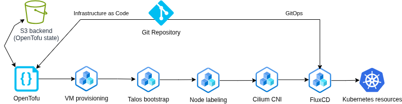

# Pilvelaevastik
Pilvelaevastik is a practical implementation developed as part of a Master’s thesis focused on designing and implementing an E-ITS compliant hardened Kubernetes cluster with automated auditing.

# How to deploy?
1. Define variables in terraform.tfvars
2. Define credentials .envrc 
3. Run tofu and enjoy:
```
tofu apply
```

Tenant projects used for Flux multi-tenancy:
```
https://github.com/opipenbe/market-team-project
https://github.com/opipenbe/cloud-team-project
```

# Cluster Bootstrapping Workflow



Demo video of this project, showcasing the bootstrapping of a Kubernetes cluster:
[](https://youtu.be/pJPI538mkpg)
